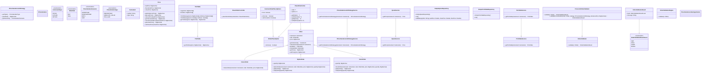

```mermaid
classDiagram
    class IPriceVarationLimitStrategy {
        + getType(): PriceVariationType
        + getValue(): BigDecimal
        + getScenario(): PriceVariationScenario
    }

    class IPriceVariation

    class ITickTable {
        + getTickSize(price: BigDecimal): BigDecimal
    }

    class IOrderPlaceOption {
        + isForce(): boolean
    }

    class InstrumentType {
        <<enumeration>>
        STOCK
        FUTURE
        OPTION
    }

    class OrderSide {
        <<enumeration>>
        BUY
        SELL
    }

    class PriceVariationScenario {
        <<enumeration>>
        ADVANTAGE
        DISADVANTAGE
        BOTH
        SKIP
    }

    class PriceVariationType {
        <<enumeration>>
        PERCENTAGE
        ABSOLUTE_VALUE
        TICK_SIZE
    }

    class Instrument {
        + symbol: String
        + type: String
    }

    class Order {
        + instrument: Instrument
        + side: OrderSide
        + price: BigDecimal
        + getInstrument(): Instrument
        + setInstrument(instrument: Instrument)
        + getSide(): OrderSide
        + setSide(side: OrderSide)
        + getPrice(): BigDecimal
        + setPrice(price: BigDecimal)
    }

    class FutureOrder {
        + FutureOrder(instrument: Instrument, side: OrderSide, price: BigDecimal)
    }

    class OptionOrder {
        + quantity: BigDecimal
        + OptionOrder(instrument: Instrument, side: OrderSide, price: BigDecimal, quantity: BigDecimal)
        + getQuantity(): BigDecimal
        + setQuantity(quantity: BigDecimal)
    }

    class StockOrder {
        + quantity: BigDecimal
        + StockOrder(instrument: Instrument, side: OrderSide, price: BigDecimal, quantity: BigDecimal)
        + getQuantity(): BigDecimal
        + setQuantity(quantity: BigDecimal)
    }

    class Price {
        + lastPrice: BigDecimal
        + theoreticalPrice: BigDecimal
        + closePrice: BigDecimal
        + getReferencePrice(): BigDecimal
        + getLastPrice(): BigDecimal
        + setLastPrice(lastPrice: BigDecimal)
        + getTheoreticalPrice(): BigDecimal
        + setTheoreticalPrice(theoreticalPrice: BigDecimal)
        + getClosePrice(): BigDecimal
        + setClosePrice(closePrice: BigDecimal)
    }

    class TickTable {
        + segments: BigDecimal[]
        + tickSizes: BigDecimal[]
        + TickTable(segments: BigDecimal[], tickSizes: BigDecimal[])
        + TickTable(segments: double[], tickSizes: double[])
        + getTickSize(price: BigDecimal): BigDecimal
    }

    class PlaceOrderController {
        + placeStockOrder(orderAction: PlaceOrderAction<StockOrder, CommonOrderPlaceOptions>)
    }

    class CommonOrderPlaceOptions {
        + force: boolean
        + isForce(): boolean
        + setForce(force: boolean)
    }

    class PlaceOrderAction {
        + order: T
        + options: O
        + getOrder(): T
        + setOrder(order: T)
        + getOptions(): O
        + setOptions(options: O)
    }

    class IPriceVariationLimitStrategyService {
        + getPriceVariationLimitStrategy(instrument: Instrument): IPriceVarationLimitStrategy
    }

    class IQuoteService {
        + getPrice(instrument: Instrument): Price
    }

    class ITickTableService {
        + getTickTable(instrument: Instrument): ITickTable
    }

    class PriceVariationLimitStrategyService {
        + getPriceVariationLimitStrategy(instrument: Instrument): IPriceVarationLimitStrategy
    }

    class QuoteService {
        + getPrice(instrument: Instrument): Price
    }

    class SimpleQuoteRepository {
        + SimpleQuoteRepository()
        + init()
        + addData(symbol: String, lastPrice: Double, closePrice: Double, theoPrice: Double)
    }

    class SimpleTickTableRepository {
        + SimpleTickTableRepository()
        + init()
    }

    class TickTableService {
        + getTickTable(instrument: Instrument): ITickTable
    }

    class IOrderValidator {
        + validate(o: Order): OrderValidationResult
    }

    class OrderValidationResult {
        + level: OrderValidationResultLevel
        + message: String
    }

    class OrderValidationResultLevel {
        <<enumeration>>
        SKIP
        PASS
        ALERT
        BLOCK
    }

    class PriceLimitOrderValidator {
        + validate(o: Order): OrderValidationResult
        + validatePriceVariation(order: Order, strategy: IPriceVarationLimitStrategy, referencePrice: BigDecimal): OrderValidationResult
    }

    class OrderValidationEngine {
        + validate(o: Order)
    }

    class PriceVariationLimiterApplication

    Order <|-- FutureOrder
    Order <|-- OptionOrder
    Order <|-- StockOrder
    TickTable --|> ITickTable
    CommonOrderPlaceOptions --|> IOrderPlaceOption
    PlaceOrderAction --|> Order
    PlaceOrderAction --|> IOrderPlaceOption
    PriceVariationLimitStrategyService --|> IPriceVariationLimitStrategyService
    QuoteService --|> IQuoteService
    TickTableService --|> ITickTableService
    PriceLimitOrderValidator --|> IOrderValidator
    OrderValidationResult --|> OrderValidationResultLevel
```